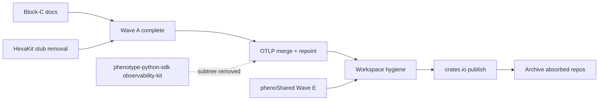

# Block-C Consolidation Plan — KooshaPari/PhenoObservability

**Date:** 2026-06-17  
**Status:** Approved for execution  
**Audit source:** `docs/audit/BLOCK-C-AUDIT.md`  
**Disposition:** `docs/boundary/DISPOSITION.md`  
**DAG lane:** Wave A (HexaKit observability crates) + Block-C boundary documentation

---

## Goal

Publish the **canonical `observe` boundary** for PhenoObservability: Rust tracing/metrics/logging/health
remain here; Python consumers default to `phenotype-python-sdk/packages/observability-kit`;
complete Wave A HexaKit absorption + phenotype-otel merge; decompose misplaced `rust/` crates;
**KEEP ACTIVE** as org-wide observability SSOT.

This **supersedes** any implicit "ObservabilityKit parity → shrink PO" interpretation —
SDK parity closes the Python slice only, not the Rust workspace (`BOUNDARY_OWNERS.md`).

---

## Current baseline (verified main @ e8af398)

| Check | Result |
|-------|--------|
| Repo archived on GitHub | FAIL (intentional — active owner) |
| `cargo check --workspace` | PASS |
| G2 HexaKit chokepoint repoint | PASS (PR #159) |
| Wave A tracingkit + metrickit | PASS (PR #157–#161) |
| `docs/boundary/DISPOSITION.md` | This PR |
| phenotype-sentry-config ported | FAIL (pending) |
| phenotype-otel merged | FAIL (pending) |
| `vendor/` deleted | FAIL (phenoShared Wave E) |
| README / STATUS disposition links | FAIL (stale) |

---

## Phase 1 — Boundary documentation (P0)

| ID | Task | Acceptance |
|----|------|------------|
| C1.1 | Publish `docs/boundary/DISPOSITION.md` | 40-row module table |
| C1.2 | Publish `docs/audit/BLOCK-C-AUDIT.md` | Verdict = AFFIRM / KEEP ACTIVE |
| C1.3 | Publish this consolidation plan | Execution DAG documented |
| C1.4 | Update `STATUS.md` + README disposition banner | Cross-references present |
| C1.5 | Add `BOUNDARY.md` linking disposition | Single SSOT chain |

**Risk:** Low — docs only.

---

## Phase 2 — Wave A completion (P1)

| ID | Task | Acceptance |
|----|------|------------|
| C2.1 | Port `phenotype-sentry-config` from HexaKit | `rust/phenotype-sentry-config` workspace member |
| C2.2 | Reconcile `metrickit` ↔ `rust/phenotype-metrics` APIs | ADR or deprecation path |
| C2.3 | Pair with HexaKit PR removing Wave A source trees | disposition-index ids 22,26,35,39,48,49 → `done` |
| C2.4 | Archive Metron / Traceon standalone repos | Registry gate evidence |

**Owner:** PhenoObservability + HexaKit wave-A removal PRs.

---

## Phase 3 — OTLP merge + consumer repoint (P2)

| ID | Task | Acceptance |
|----|------|------------|
| C3.1 | Merge `phenotype-otel` into PO workspace | RFC 001 non-goal preserved (thin OTLP only) |
| C3.2 | Fleet manifest scan: repoint OTLP consumers | No separate phenotype-otel git dep |
| C3.3 | README: Python → SDK `[observe]` extra; Rust → workspace crates | No ObservabilityKit install path |
| C3.4 | Document git dependency pattern for external consumers | RFC 001 example updated |

---

## Phase 4 — Workspace hygiene (P2–P3)

| ID | Task | Acceptance |
|----|------|------------|
| C4.1 | Decompose `rust/phenotype-security-aggregator` → Authvault | PO workspace slimmed |
| C4.2 | Decompose `rust/phenotype-mock` → TestingKit | No test utils in observe |
| C4.3 | Resolve `rust/phenotype-compliance-scanner` duplicate | Single owner (TestingKit or compliance repo) |
| C4.4 | phenoShared publish → replace `vendor/` with git deps | Delete vendor/ directory |
| C4.5 | Delete `docs/operations/iconography/` + deprecated helix-logging | Ponytail PR |
| C4.6 | Slim aspirational ADRs + root markdown zoo | Evidence retained in registry sessions |

---

## Phase 5 — Fleet stamp (P4–P5)

| ID | Task | Acceptance |
|----|------|------------|
| C5.1 | Publish observe crates to crates.io | Manifest repoint off git URL |
| C5.2 | disposition-index Wave A rows → `fsm: done` | Registry PR |
| C5.3 | Archive absorbed source repos (Metron, Traceon, ObservabilityKit) | All 5 gate conditions PASS |

**Default:** PhenoObservability remains **KEEP ACTIVE** — primary observe release train.

---

## Parallel dependencies

---

## Related documents

- [`docs/boundary/DISPOSITION.md`](../boundary/DISPOSITION.md)
- [`docs/disposition/wave-a-absorption.md`](../disposition/wave-a-absorption.md)
- [HexaKit DISPOSITION rows #22, #26, #35, #39, #48, #49](https://github.com/KooshaPari/HexaKit/blob/main/docs/boundary/DISPOSITION.md)
- [phenotype-registry BOUNDARY_OWNERS §Observability](https://github.com/KooshaPari/phenotype-registry/blob/main/BOUNDARY_OWNERS.md)
- [RFC 001 Traceon → observe](https://github.com/KooshaPari/phenotype-registry/blob/main/docs/rfc/001-traceon-observe-role.md)
